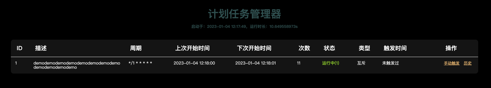
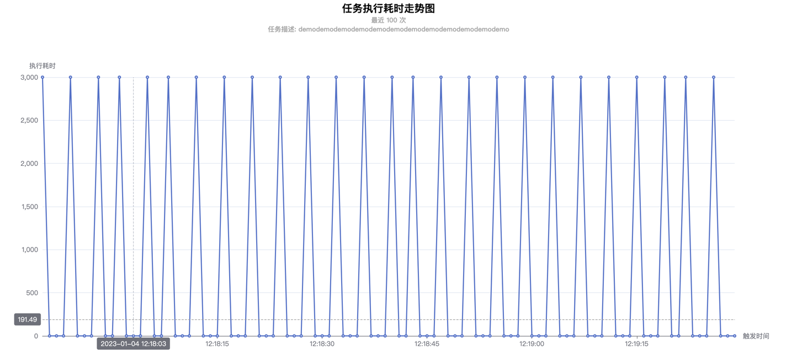

# 计划任务通用服务

功能如下：

- 提供标准web界面管理任务，列表任务，可手动触发任务。
- 提供http handler，自定义url管理路径。
- 提供方法添加任务，删除任务，列表任务。
- 提供http json格式任务列表接口。
- 提供手动触发http接口。
- 触发的任务正在运行，此次触发动作会被忽略。
- 前面的任务没有执行完毕，后面启动的任务会被跳过。

## 集成

gocron.HandlerFunc()提供标准的http.HandlerFunc， 凡是支持添加http.HandlerFunc为路由方法的路由都能使用。

集成到http web页面, 示例代码：

```go
// crontab service toolkit
http.HandleFunc("/crontab/", cron.HandlerFunc())
```

/crontab/是管理路径，路径确定后，会有下面三个地址可以使用：

1. /crontab/joblist 任务管理页面。
2. /crontab/triggerjob?jobid=111 触发任务接口，111是任务ID，返回json数据`{"code":200,"data":"success","msg":""}`。
3. /crontab/joblist.json 任务列表json数据。

任务列表json数据格式，示例数据如下：

```json
{
  "code": 200,
  "data": [
    {
      "job_id": 1,
      "cron_exp": "*/1 * * * * *",
      "description": "test list",
      "prev_at": 1630398420,
      "next_at": 1630398421,
      "trigger_at": 1,
      "running_count": true
    },
    {
      "job_id": 2,
      "cron_exp": "*/2 * * * * *",
      "description": "test list",
      "prev_at": 1630398420,
      "next_at": 1630398422,
      "trigger_at": 0,
      "running_count": 0
    }
  ],
  "msg": ""
}
```

数据说明：

```text
code：200 代表成功，其它代码代表失败，失败的时候msg是错误信息。 

job_id：任务ID

cron_exp：任务执行周期crontab表达式，除了5位标准crontab写法，还支持6位写法，第一位是秒。

description：添加任务的时候，任务描述信息。

prev_at：unix秒时间戳，上次执行启动时间，不一定真的被执行，如果前面的任务没结束，
         执行会被跳过，这里的是周期启动时间。

next_at：unix秒时间戳，下次执行的时间。

trigger_at：unix秒时间戳，手动触发时间，触发的任务正在运行，此次触发动作会被忽略。

running_count：任务是在运行的数量，0代表没有运行。互斥模式下：1代表正在运行；非互斥模式下：表示同一个任务正在并行执行的数量。
```

## cron包提供下面方法

具体用法参数，可以看IDE代码提示。

```go
gocron.TriggerJob()
gocron.GetJob()
gocron.JobList()
gocron.AddJob()
gocron.RemoveJob()
gocron.HandlerFunc()
```

添加一个计划任务示例：

```go
jobID, err := gocron.AddJob(Job{
CronExp:     "* * * * * *",
Description: "test list",
Mutex: true,
Executor: func () {

},
})
```

# 管理界面截图，先睹为快

## 管理列表


## 执行历史
